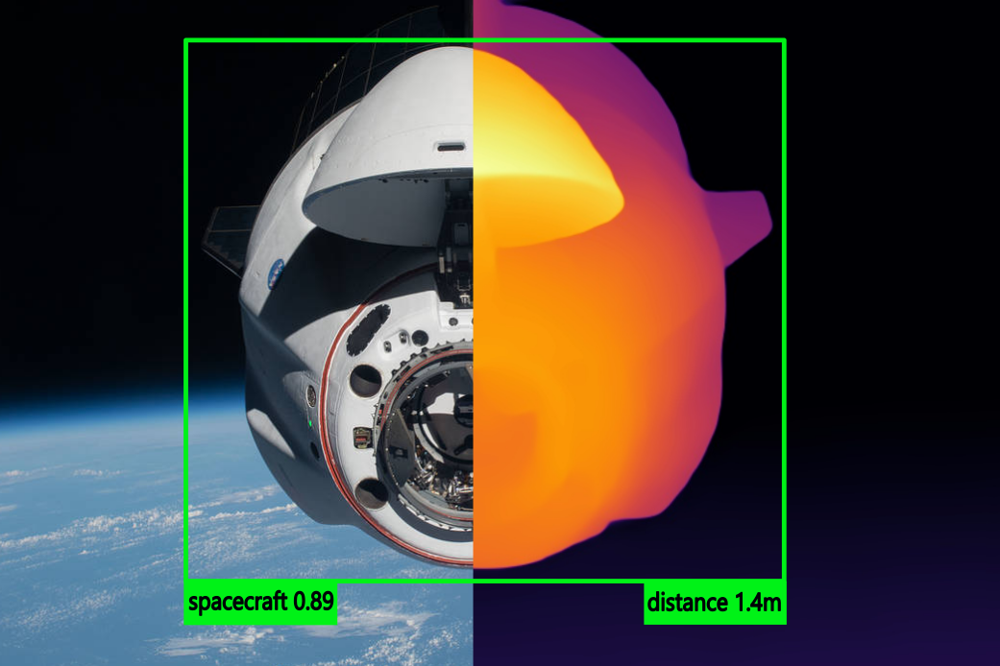
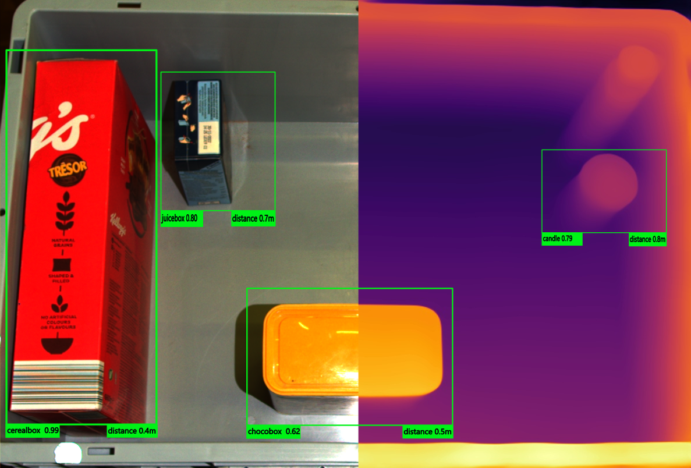
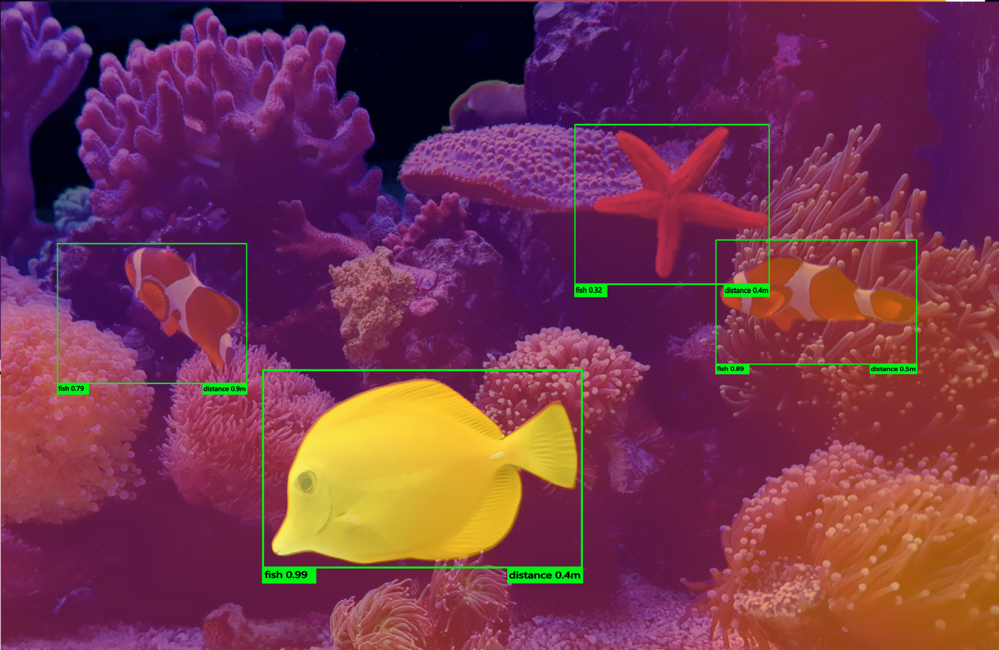

# Distance2Object
D2O is an end-end object detection and monocular depth estimation pipeline that enables predicting distance to an object using just an rgb camera.
The image is inferenced simlutenousely using MiDaS and Yolov8 and the resulting bounding boxes with prediction and depth information is fused for the output. 
Some of the usecases of such a system can be seen below:

## Contact
This project is a work in progress. If you are interested in the project and would like to collaborate. [contact me](ashwinnedungadi007@gmail.com)
